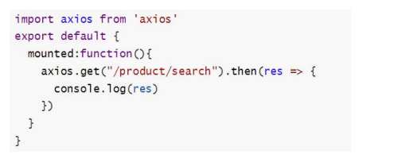
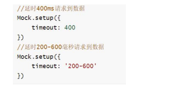
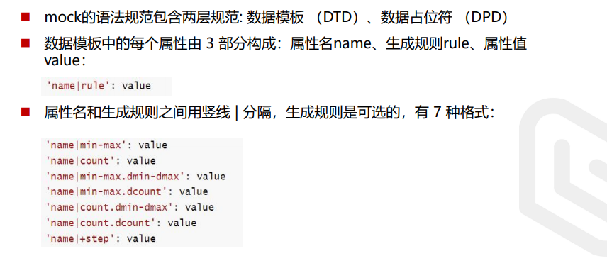

### 前端数据模拟MockJS

#### 导入MockJS
npm install mockjs

#### mock/index.js
```js
//引入mock.js
import { Mock } from "mockjs";
//设置延迟时间
Mock.setup({
    timeout:4000
})
//使用mockjs模拟数据
//这个链接地址要和前端axios发送的地址要一致才可以进行拦截
Mock.mock('/product/search',{
    "ret":0,
    "data":{
        "mtime":"@datetime",//随机生成日期时间
        "score|1-800":1,
        "rank|1-100":1,
        "stars|1--5":1,
        "nickname":"@cname",//随机生成中文名字
        //生成图片
        "img":"@image('200*10')"
    }
});
```

#### 在mian.js中导入
```js
//导入
import './mock/index'
```

#### 在组件中使用
```vue
<template>
  <div id="app">
    
  </div>
</template>

<script>
import axios from 'axios'
export default {
  name: 'App',
  components: {
  },
  data(){
    return{
      img:''
    }
  },
  mounted() {
    axios.get("/product/search").then(res=>{
      //这个res的MockJS返回的数据
      console.log(res)
      console.log(res.data.data.img);
      this.img=res.data.data.img
    })
  }
}
</script>

```

## 基本使用
组件中调用mock.js中模拟的数据接口，这时返回的response就是mock.js中用 Mock.mock(‘url’,data）中设置的data


### 核心方法
Mock.mock( rurl?, rtype?, template|function( options ) )
 rurl，表示需要拦截的 URL，可以是 URL 字符串或 URL 正则
 rtype，表示需要拦截的 Ajax 请求类型。例如 GET、POST、PUT、DELETE 等。
 template，表示数据模板，可以是对象或字符串
 function，表示用于生成响应数据的函数。
 设置延时请求到数据



### 数据生成规则
